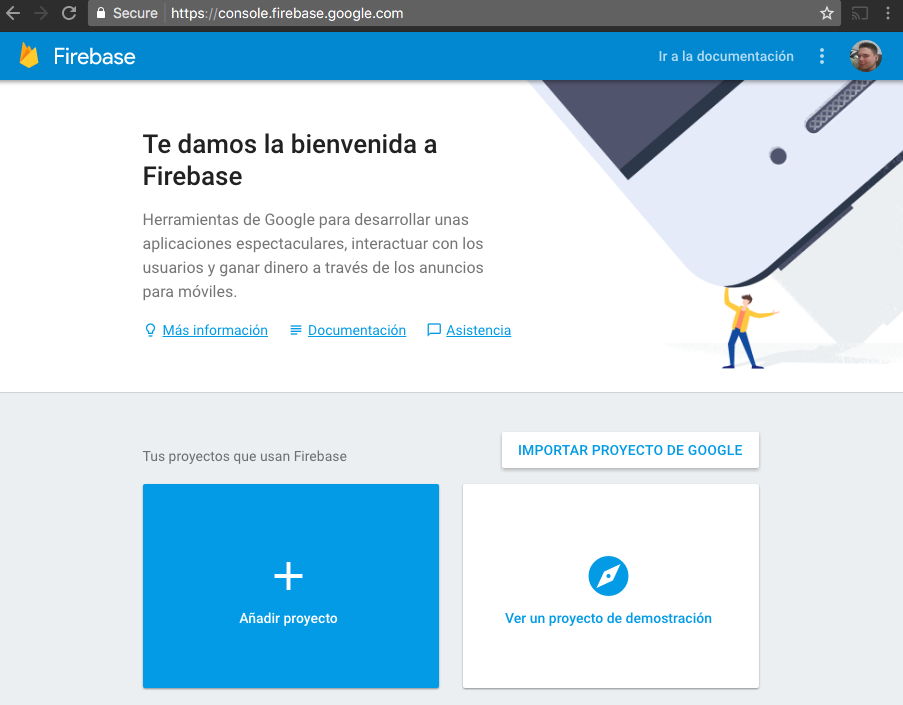
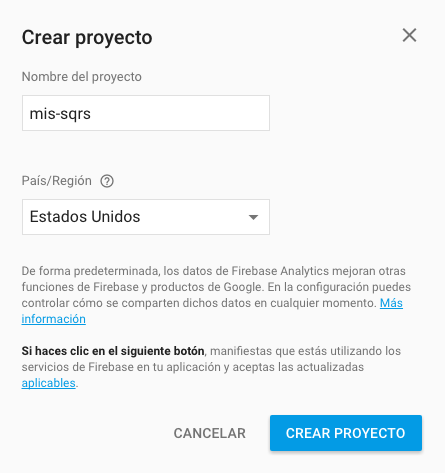
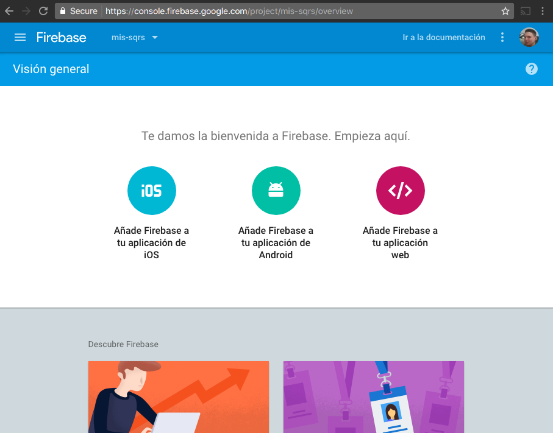
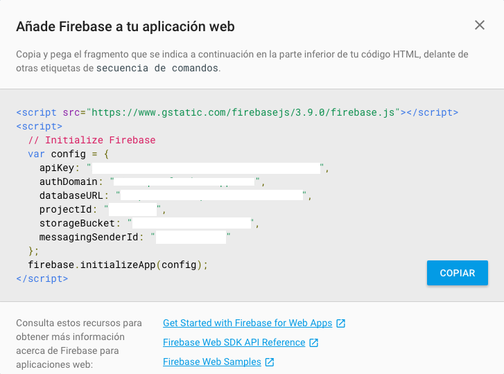
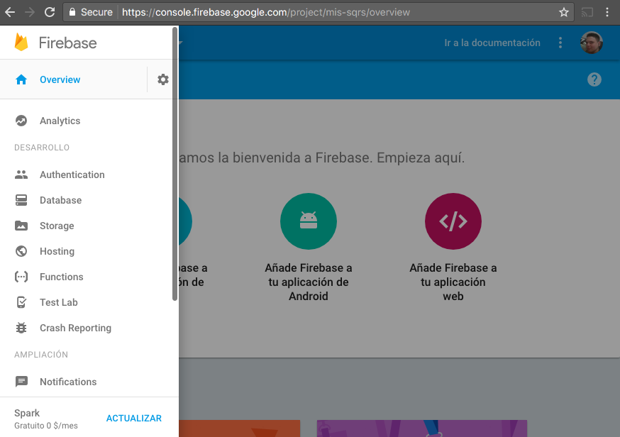
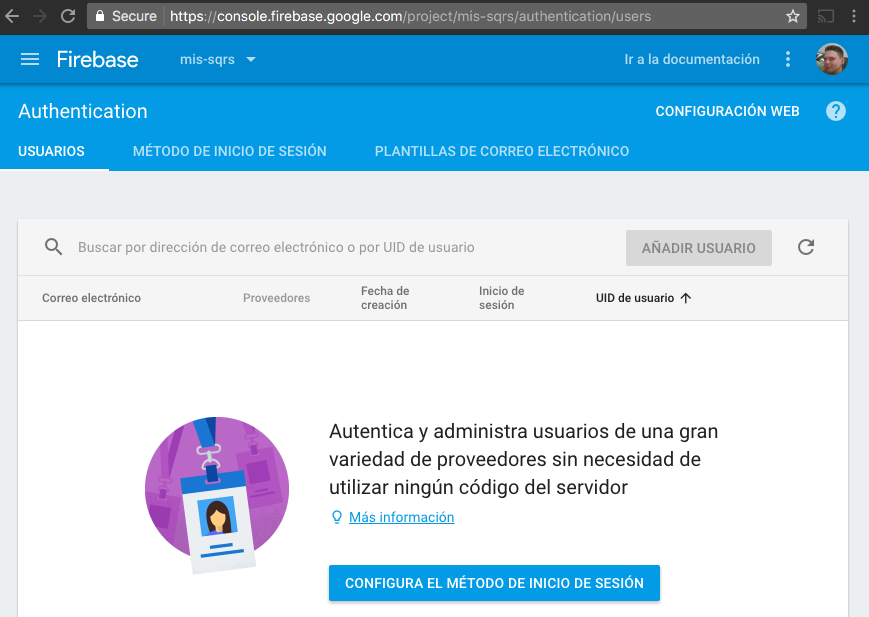
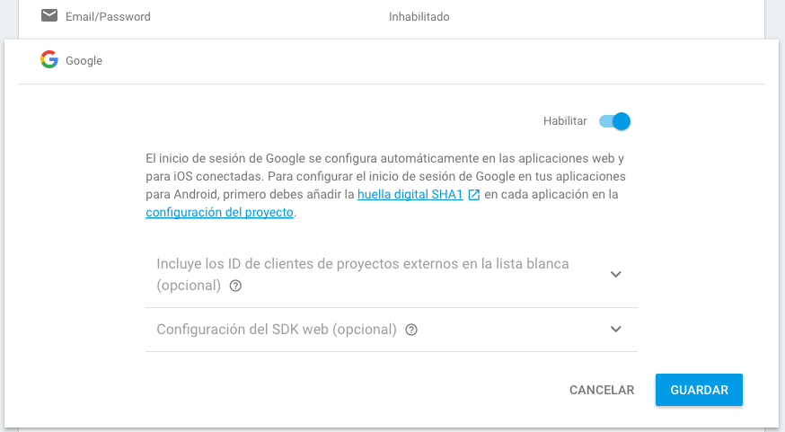

# SQRs App

## Firebase configuration

Copy and rename the `config.js.example` to `config.js`.

Open [the firebase console](https://console.firebase.google.com) and log in with your
google user.

Click on `Añadir proyecto`.

Set the project name (`Nombre del proyecto`) and click on `CREAR PROYECTO`.

Once the creation project have finished going to show the project's general view,
  here you should click in `Add Firebase to your web application` (`Añade Firebase
  a tu aplicación web`).

Now you have to see a dialog with the values to put in the `config.js` file

## Enabling google authentication

Once you have the firebase configuration done, you have to enable the firebase
authentication. To this you have to clic in `Authentication` option on the
left menu.

In the Authentication dashboard clic in `Configure authentication method` (
  `CONFIGURA EL MÉTODO DE INICIO DE SESIÓN`).

Now, when you put the mouse over google, it should show a pencil icon on the
right side, click in this icon and enable the Google Authentication. Finally
click in `Save` (`Guardar`)

## Start the application

The app was developed using:
  - node v6.9.4
  - npm v3.10.10
  - yarn v0.16.1
  (You should have install this depedencies)

### Install yarn

`npm install -g yarn`

### Excecuting the application in dev mode

`yarn serve`

### Bulding

`yarn build`

### Deploy

`yarn deploy`
